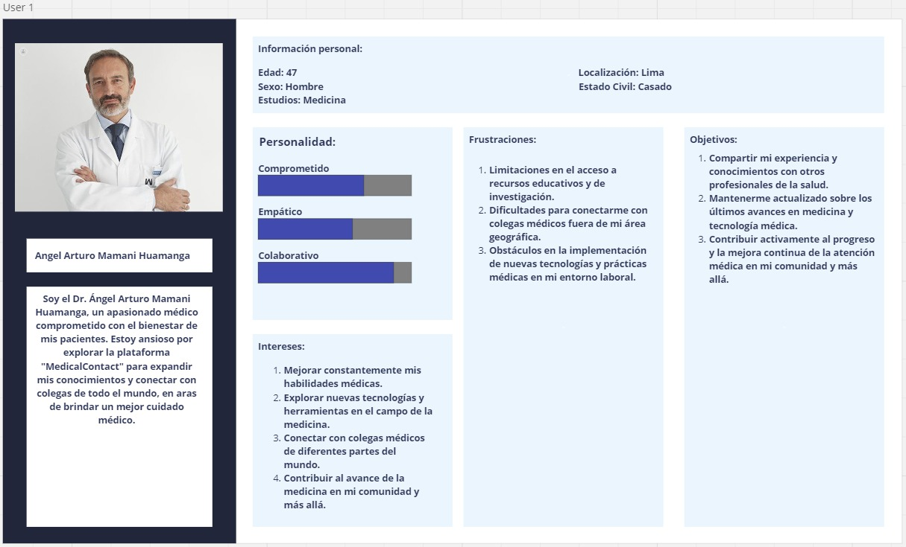
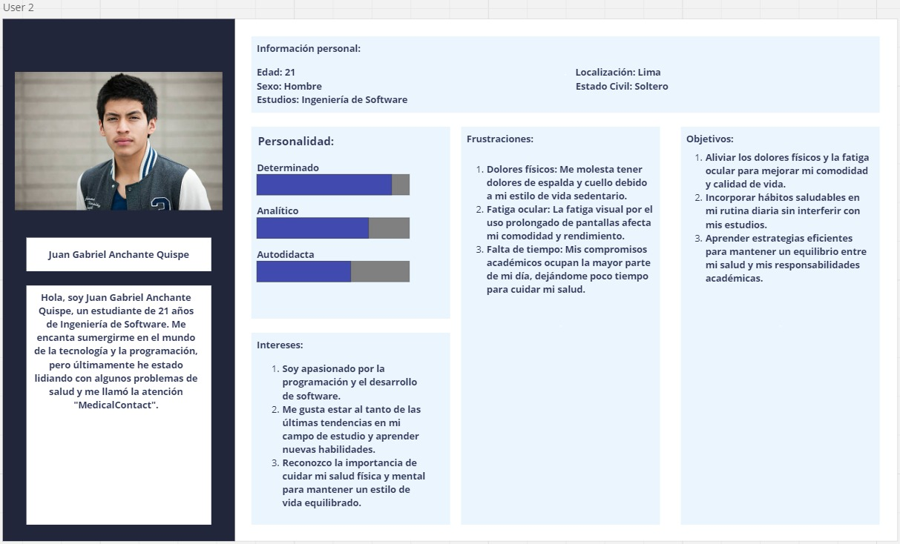

# CAPÍTULO II: REQUIREMENTS ELICITATION & ANALYSIS
# 2.1. Competidores
## 2.1.1. Análisis competitivo
<table>
<tr>
<th colspan="7">Competitive Analysis Landscape</th>
</tr>
<tr>
<td colspan="2" rowspan="2">¿Por qué llevar a cabo este análisis?</td>
<td colspan="5">Escriba en el recuadro la pregunta que busca responder o el objetivo de este análisis.</td>
</tr>
<tr>
<td colspan="5"></td>
</tr>
<tr>
<td colspan="3">(En la cabecera colocar por cada competidor nombre y logo)</td>
<td>MedicalContact</td>
<td>Logo Doctoralia</td>
<td>Logo Mifarma Movil</td>
<td>Logo SPORTLIFE PERU</td>
</tr>
<tr>
<td rowspan="2">PERFIL</td>
<td colspan="2">Overview</td>
<td>es una aplicación web para la gestión de atención médica que proporciona herramientas para pacientes y médicos, incluyendo registro de citas, historiales médicos y recordatorios.</td>
<td>Es una aplicación web para la gestión de atención médica que ayuda a los profesionales de la salud a tener mayor visibilidad online con múltiples herramientas digitales.</td>
<td>Es una aplicación web para la gestión de atención médica que ofrece ofertas y rebajas sobre medicamentos para recoger o solicitar delivery.</td>
<td>Es una aplicación web sobre una comunidad médica líder para profesionales de la salud. Con un fuerte enfoque en proporcionar el mejor contenido de calidad, te traemos contenido exclusivo, seleccionado a mano de las mejores y más reputadas fuentes de salud.</td>
</tr>
<tr>
<td colspan="2">Ventaja competitiva ¿Qué valor ofrece a los clientes?</td>
<td>ofrece una plataforma integral para la gestión de atención médica, con funciones específicas para pacientes y médicos, facilitando la comunicación y la programación de citas.</td>
<td>Ofrece una plataforma integral para la gestión de atención médica, con un enfoque en la visibilidad en línea para los profesionales de la salud.</td>
<td>Proporciona ofertas y descuentos en medicamentos, además de servicios de entrega a domicilio.</td>
<td>Se destaca por proporcionar contenido exclusivo y de calidad para profesionales de la salud.</td>
</tr>
<tr>
<td rowspan="2">PERFIL DE MARKETING</td>
<td colspan="2">Mercado objetivo</td>
<td>se dirige a pacientes y profesionales de la salud que buscan una solución eficiente para la gestión de atención médica.</td>
<td>Se enfoca en profesionales de la salud que desean aumentar su visibilidad en línea y en pacientes que buscan servicios médicos.</td>
<td>Apunta a pacientes que buscan conveniencia y ahorro en medicamentos, así como a aquellos que prefieren la entrega a domicilio.</td>
<td>Dirigido a profesionales de la salud en busca de contenido de calidad y actualizado, así como a aquellos interesados en la comunidad médica.</td>
</tr>
<tr>
<td colspan="2">Estrategias de marketing</td>
<td>utiliza estrategias de marketing digital, redes sociales y colaboraciones con centros médicos para promover su plataforma.</td>
<td>Se basa en estrategias de marketing digital, SEO (optimización de motores de búsqueda) y colaboraciones con instituciones médicas para aumentar su visibilidad y su base de usuarios.</td>
<td>Emplea tácticas de marketing digital, campañas promocionales en línea y asociaciones con farmacias para destacar sus ofertas y servicios de entrega a domicilio.</td>
<td>Se centra en la creación y distribución de contenido de calidad para profesionales de la salud, utilizando estrategias de marketing de contenido y asociaciones con expertos médicos para amplificar su alcance y credibilidad.</td>
</tr>
<tr>
<td rowspan="3">PERFIL DE PRODUCTO</td>
<td colspan="2">Productos & Servicios</td>
<td>ofrece funciones como gestión de citas, historiales médicos, recordatorios y comunicación entre pacientes y médicos.</td>
<td>Proporciona una plataforma online para que los profesionales de la salud aumenten su visibilidad y para que los pacientes encuentren y reserven citas médicas.</td>
<td>Ofrece descuentos en medicamentos y servicios de entrega a domicilio.</td>
<td>Ofrece contenido educativo y de calidad para profesionales de la salud.</td>
</tr>
<tr>
<td colspan="2">Precios & Costos</td>
<td>opera bajo un modelo de negocio transaccional, cobrando a los pacientes un sobrecosto por el uso de la aplicación en el pago por la atención médica.</td>
<td>Ofrece un servicio gratuito para pacientes y planes de suscripción para profesionales médicos.</td>
<td>Los servicios son gratuitos para los usuarios, pero se pueden aplicar cargos por los medicamentos y la entrega.</td>
<td>El acceso al contenido es gratuito para los usuarios.</td>
</tr>
<tr>
<td colspan="2">Canales de distribución (Web y/o Móvil)</td>
<td>está disponible como una aplicación web accesible desde cualquier navegador.</td>
<td>Está disponible como una plataforma web y una aplicación móvil.</td>
<td>Está disponible como una aplicación móvil y un sitio web.</td>
<td>Está disponible como un sitio web y una aplicación móvil.</td>
</tr>
<tr>
<td rowspan="5">ANÁLISIS SWOT</td>
<td colspan="6">Realice esto para su startup y sus competidores. Sus fortalezas deberían apoyar sus oportunidades y contribuir a lo que ustedes definen como su posible ventaja competitiva.</td>
</tr>
<tr>
<td colspan="2">Fortalezas</td>
<td>Plataforma integral, facilidad de uso, modelo de negocio transaccional</td>
<td>Ofrece visibilidad en línea para profesionales de la salud.</td>
<td>Ofertas y rebajas en medicamentos.</td>
<td>Comunidad médica líder con contenido seleccionado a mano.</td>
</tr>
<tr>
<td colspan="2">Debilidades</td>
<td>Necesidad de construir reconocimiento de marca, competencia establecida.</td>
<td>Dependencia de la adopción por parte de los profesionales de la salud.</td>
<td>Dependencia de la disponibilidad de medicamentos y proveedores de entrega.</td>
<td>Menos enfoque en la gestión de atención médica para pacientes.</td>
</tr>
<tr>
<td colspan="2">Oportunidades</td>
<td>Crecimiento del mercado de atención médica digital, demanda de soluciones de gestión eficientes.</td>
<td>Crecimiento continuo de la demanda de servicios médicos en línea.</td>
<td>Aumento de la demanda de servicios de entrega a domicilio.</td>
<td>Potencial para expandirse a otras áreas de la salud, como la gestión de pacientes.</td>
</tr>
<tr>
<td colspan="2">Amenazas</td>
<td>Competencia de empresas establecidas, regulaciones gubernamentales en el sector de la salud.</td>
<td>Competencia de otras plataformas similares.</td>
<td>Regulaciones en la venta y distribución de medicamentos.</td>
<td>Cambios en las preferencias de los usuarios y la demanda de contenido.</td>
</tr>
</table>

## 2.1.2. Estrategias y tácticas frente a competidores
Tras analizar a nuestros competidores en el campo de la gestión de atención médica, hemos identificado tanto sus fortalezas como sus debilidades, lo que nos permite elaborar estrategias efectivas para posicionarnos en el mercado y diferenciarnos de ellos. 

**Fortalezas de los competidores**

- Agilización de procesos y recompensas al cliente. 
- Sistema de ventas en línea y control del negocio. 
- Localización de médicos y conocimiento de promociones. 

**Nuestras fortalezas** 

- Facilidad y flexibilidad del sitio web para beneficio del usuario. 
- Programa de bonificación para pacientes a través de puntos canjeables. 
- Gestión de inventario médico para facilitar el trabajo de los profesionales. 

**Estrategias para superar a nuestros competidores** 

- Actualización constante de la aplicación para mejorar la experiencia del usuario. 
- Implementación de nuevas funcionalidades para beneficio de pacientes y médicos. 

**Tácticas para superar a nuestros competidores** 
- Implementación de un sistema de notificaciones y novedades para motivar la participación de los usuarios. 

**Debilidades de los competidores** 

- Baja tasa de interacción de los usuarios. 
- Soporte de bajo nivel de asistencia. 
- No disponible en ciertas regiones geográficas. 

**Nuestras debilidades** 

- Sistema de filtrado de búsquedas. 

**Estrategias para diferenciarnos de nuestros competidores** 

- Mantenimiento de una comunicación constante con los usuarios para mejorar su experiencia. 
- Implementación de soportes y actualizaciones frecuentes. 

**Tácticas para diferenciarnos de nuestros competidores** 

- Implementación de un agente de soporte para resolver dudas de los usuarios. 
- Actualizaciones constantes para mejorar la experiencia del usuario. 
- Implementación de un sistema de filtrado de búsquedas para facilitar la búsqueda de médicos y citas. 

**Oportunidades de los competidores** 

- Integración de más funcionalidades publicitarias. 
- Incremento del número de usuarios. 
- Crecimiento del interés por la atención médica en diversas regiones. 

**Nuestras oportunidades** 

- Crecimiento del público interesado en la aplicación. 
- Facilidad de comprensión de la aplicación para los usuarios. 

**Estrategias para aprovechar las oportunidades** 

- Desarrollo de una aplicación intuitiva y fácil de usar. 
- Campañas publicitarias en redes sociales para captar la atención de nuevos usuarios. 

**Tácticas para aprovechar las oportunidades** 

- Implementación de un diseño minimalista pero atractivo. 
- Campañas publicitarias dirigidas en redes sociales. 

**Amenazas de los competidores** 

- Dependencia exclusiva de dispositivos móviles. 
- Soporte rápido para regiones específicas. 
- Problemas de mantenimiento de software 

**Nuestras amenazas** 

- Tiempo de respuesta del servidor. 
- Estrategias para contrarrestar nuestras amenazas 
- Desarrollo de un tiempo de respuesta rápido del servidor. 

**Tácticas para contrarrestar nuestras amenazas** 

- Implementación de servicios en la nube para mejorar la disponibilidad y velocidad de respuesta. 
- Mantenimientos constantes para optimizar el rendimiento de la aplicación. 
# 2.2. Entrevistas
**1. Personas a las que entrevistaremos:** Las personas entrevistadas serán pacientes y profesionales de la salud mayores de 18 años. 

**2. Aspectos generales:** Es fundamental comprender los conceptos básicos relacionados con la gestión de citas, historiales médicos y consultas virtuales, así como conocer las funcionalidades ofrecidas por otras plataformas similares. Además, es importante comprender cómo nuestro servicio se diferencia y beneficia a nuestros usuarios. 

**3. Tipo de entrevista que realizaremos:** Las entrevistas se llevarán a cabo de manera virtual y formal, asegurando un ambiente profesional para la interacción entre entrevistador y entrevistado. 

**4. Duración de la entrevista:** Cada entrevista tendrá una duración máxima de entre 3-10 minutos, garantizando la eficiencia y la captura de información relevante sin sobrecargar al entrevistado. 
## 2.2.1. Diseño de entrevistas
**1. Preguntas para MÉDICOS:**

**Datos personales:**
* Nombre completo
* Especialidad médica
* Experiencia laboral en el campo de la medicina
* En promedio de días, cuánto es el número promedio de pacientes atendidos por dia

**Respecto al tema:**
1. ¿Cuál es tu especialidad médica y cuál es el período más largo que has estado sin pacientes?
2. ¿Qué características consideras más útiles en tu trabajo diario como médico?
3. ¿Has enfrentado desafíos específicos al realizar citas médicas virtuales en tu práctica?
4. ¿Has notado algún impacto en la comunicación o interacción con tus pacientes durante las citas virtuales?
5. ¿Cómo crees que una aplicación centrada en conectar médicos con pacientes que necesitan su especialidad mejoraríala eficiencia de tu práctica médica?

**2. Preguntas para PACIENTES:**
* Nombre completo
* Edad
* Ocupación
* ¿Con qué frecuencia necesitas la atención de un médico?

**Respecto al tema:**
1. ¿Experimentas dificultades al reservar citas médicas en tu clínica u hospital?
2. ¿Has tenido alguna dificultad para entender a tu médico o para que él te entienda durante las citas?
3. ¿Consideras que el tiempo de espera, la reserva de citas y la ejecución de las mismas en tu centro médico son eficientes?
4. ¿Qué sugerencias o recomendaciones tendrías para mejorar la experiencia del paciente en tu centro de salud?
5. ¿Encuentras fácilmente la información necesaria sobre tu cita médica, como la ubicación, hora y médico asignado?
6. ¿Te sientes cómodo/a y bien atendido/a durante tus citas médicas en el centro de salud?
7. ¿Has tenido alguna experiencia positiva o negativa con el personal administrativo o médico en tu centro de salud?

## 2.2.2. Registro de entrevistas
| Entrevista #1            | A cargo de: XXXXXXXXXXXXXXXXXX |
|--------------------------|-----------------------------------------|
| Persona Entrevistada     | XXXXXXXX (XX AÑOS)       |
| Distrito                 | XXXXXXXXXXXXXXXX       |
| Duración                 | X:XX                                    |
| Enlace                   | XXXXXXXX           |
| Análisis     |XXXXXXXXX|
| ScreenShot     ||

| Entrevista #2            | A cargo de: XXXXXXXXXXXXXXXXXX |
|--------------------------|-----------------------------------------|
| Persona Entrevistada     | XXXXXXXX (XX AÑOS)       |
| Distrito                 | XXXXXXXXXXXXXXXX       |
| Duración                 | X:XX                                    |
| Enlace                   | XXXXXXXX           |
| Análisis     |XXXXXXXXX|
| ScreenShot     ||

| Entrevista #3            | A cargo de: XXXXXXXXXXXXXXXXXX |
|--------------------------|-----------------------------------------|
| Persona Entrevistada     | XXXXXXXX (XX AÑOS)       |
| Distrito                 | XXXXXXXXXXXXXXXX       |
| Duración                 | X:XX                                    |
| Enlace                   | XXXXXXXX           |
| Análisis     |XXXXXXXXX|
| ScreenShot     ||

## 2.2.3. Análisis de entrevistas
En esta sección se debe realizar un análisis por cada segmento objetivo,
identificando con sustento estadístico (porcentajes) todas las características
objetivas y subjetivas que representan los aspectos más comunes de cada segmento
y que son necesarios para la construcción de los arquetipos. La fuente de
información para este análisis proviene de las entrevistas registradas. Debe
evidenciarse que cada característica tiene relación con las entrevistas registradas y
los resúmenes realizados para las mismas.
## 2.3. Needfinding.
### 2.3.1. User Personas. 

### 2.3.2. User Task Matrix.
**Estudiantes colegiales o universitarios:** 
|  |  User 1  | User 2 |
| --- | ----------- | ------------ |
| Es un estudiante universitario.  | NO   | SI|
| Conoce alguna plataforma en la cual pueda tener alguna relación sobre gestión médica. | NO | NO        |
| Esta interesado en reservar citas virtuales y ver recetas médicas de manera eficiente y segura.  | NO | SI        |
| Le interesan temas médicas. | SI | POCO        |

**Egresados de carreras universitarias y/o tecnicas:** 
|  |  User 1  | User 2 |
| --- | ----------- | ------------ |
| Ha culminado alguna carrera universitaria y/o tecnica  | SI   | A PUNTO DE EGRESAR|
| Le interesa expandir su conocimiento sobre su campo | SI | NO        |
| Conoce alguna plataforma para tener acceso a una plataforma digital que facilite la conexión entre médicos y pacientes. | SI | SI        |
| Esta interesado en descargar libros, tesis, investigaciones científicas sobre la salud. | SI | NO        |

### 2.3.3. User Journey Mapping.
**Registration:**
Why would they trust us?
- Los usuarios exploran la reputación de MedicalContact a través de fuentes confiables, como reseñas en línea y testimonios de otros usuarios.
- Revisan las políticas de privacidad y las medidas de seguridad de la plataforma para asegurarse de que sus datos estén protegidos.
  
**Onboarding and first use:**
How can they feel successful?
- Porque los usuarios experimentan un proceso de registro intuitivo y sin contratiempos, con claras indicaciones sobre los datos necesarios y los pasos a seguir.
- Porque los usuarios se sienten capacitados para explorar la plataforma de manera intuitiva, con una interfaz de usuario clara y organizada que les permite acceder rápidamente a la información que necesitan.
- También se ofrece a los usuarios tutoriales interactivos y guías prácticas para aprovechar al máximo las diversas características de MedicalContact, asegurando que se sientan cómodos y competentes al utilizar la plataforma.
  
**Sharing:**
Why would they invite others?
- Porque los usuarios descubren el valor de MedicalContact al experimentar beneficios tangibles, como la facilidad de reserva de citas virtuales, la gestión eficiente de historiales médicos y la seguridad en la comunicación con los profesionales de la salud.
- También recompensan a los usuarios por invitar a amigos y familiares a unirse a MedicalContact, ofreciendo incentivos como descuentos en servicios médicos o créditos en la plataforma.

### 2.3.4. Empathy Mapping.

### 2.3.5. As-is Scenario Mapping.

## 2.4. Ubiquitous Language.
